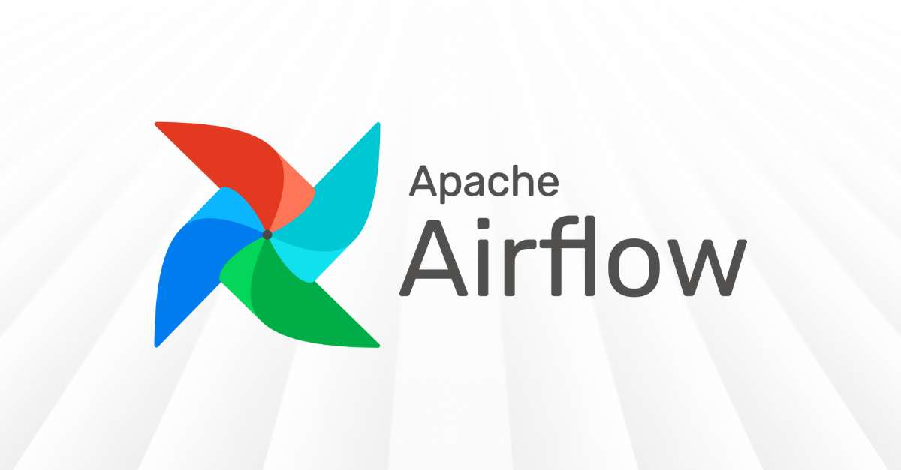

# notifyML

notifyML est un projet Python qui combine des workflows Airflow et une API Flask pour orchestrer et notifier des pipelines de machine learning.

## Aperçu
- Airflow est utilisé pour définir et exécuter les DAGs (workflows) présents dans le dossier `dags/`.
- Une API Flask (dans `dags/Flask_API.py`) fournit des endpoints pour interagir avec les pipelines et notifications.
- L’environnement virtuel pour Airflow se trouve dans `airflow_env/`.
- Le code principal de l’application se trouve dans `python/notifyML/`.

## Structure principale
- `airflow/` — configuration Airflow et données liées à l’environnement d’Airflow (Voir [`airflow/airflow.cfg`](airflow/airflow.cfg)).
- `airflow/dags/` — DAGs et code Flask :
  - [`dags/Flask_API.py`](dags/Flask_API.py)
  - [`dags/main.py`](dags/main.py)
- `notifyML/` — package/application principal.
- `requirements.txt` — dépendances Python.
- `LICENSE` — licence MIT.

## Prérequis
- Python 3.12,
- pip,
- Virtualenv ou venv
- MailCatcher
- Airflow 3.1

## Installation rapide
1. Créer et activer un environnement virtuel :
```bash
python3 -m venv airflow_env
source airflow_env/bin/activate
```
2. Installer les dépendances :
```bash
pip install -r requirements.txt
```

## Installation d'Apache Airflow 3.1

1) Configuration des variables d'environnement:
```bash
pip install apache-airflow
```

2) Configuration une variable d'environnement:
```bash
export AIRFLOW_HOME=$(pwd)/airflow
```

3) Installer PostgreSQL:
```bash
sudo apt install postgresql postgresql-contrib
```

4) Lancer le service PostgreSQL:
```bash
sudo systemctl start postgresql
```

5) Acceder à PostgreSQL:
```bash
# acceder à postgres
sudo -u postgresql

# creer un nouvelle utilisateur
CREATE USER airflow PASSWORD 'airflow';

# creer une nouvelle database
CREATE DATABASE notifyml;

# donner tout les priviléges au user airflow
GRANT ALL PRIVILEGES ON ALL TABLES IN SCHEMA public TO airflow;

# autoriser le user airflow sur la database notifyml
ALTER DATABASE notifyml OWNER TO airflow;

# accorder tout les privilége des schéma public
GRANT ALL ON SCHEMA public TO airflow;

# quitter
exit;

```

## Installation MailCatcher (Linux / WSL)

MailCatcher est un outil simple pour intercepter les emails envoyés localement (SMTP) et les afficher dans une interface web.

1) Dépendances (Debian/Ubuntu / WSL)
```bash
sudo apt update
sudo apt install -y ruby ruby-dev build-essential libsqlite3-dev
```

2) Installer MailCatcher

```bash
sudo gem install mailcatcher
```

3) Lancer MailCatcher
```bash
# lancement accessible depuis localhost (HTTP 1080, SMTP 1025)
mailcatcher
```

4. Ouvrir l’interface Airflow à `http://localhost:8080` et activer/exécuter les DAGs présents dans `dags/`.

## Commande airflow
- Démarrage des services
```bash
# Démarrer le webserver + scheduler
airflow standalone
```

> quand le `airflow standalone` est lancer, cela creer un fichier *`airflow/simple_auth_manager_passwords.json.generated`* qui donne l'identifiant et le mot de passe

- Gestion de la base de données
```bash
# Initialiser la base de données
airflow db migrate

# Réinitialiser la base de données (attention: supprime toutes les données!)
airflow db reset
```

## Développement
- Placer le code métier dans `python/notifyML/`.
- Ajouter ou modifier des DAGs dans `dags/`.
- Utiliser les logs Airflow dans `logs/` pour déboguer les exécutions de DAG.

## Licence
Ce projet est sous licence MIT. Voir [LICENSE](LICENSE).

## Remarques
- Vérifie `airflow/airflow.cfg` pour les configurations spécifiques de l'instance Airflow.